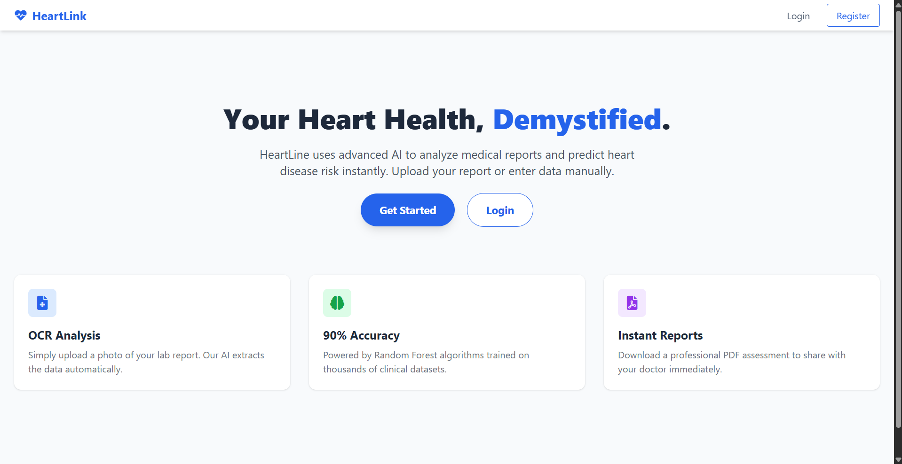
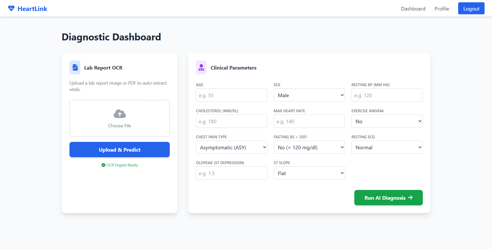
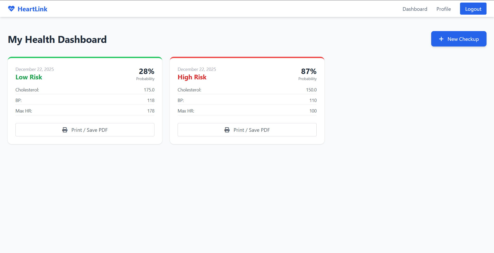

# ❤️ Heart-Link  
### AI-Powered Heart Disease Risk Prediction System

Heart-Link is a full-stack web application designed to assist in the **early detection of heart disease** using **Machine Learning** and **OCR-based medical report analysis**. The platform enables both **manual clinical data entry** and **automated extraction from lab reports**, delivering accurate risk predictions along with downloadable medical reports.

> ⚠️ **Disclaimer:** This project is intended for academic and demonstration purposes only and must not be used as a substitute for professional medical diagnosis.

## 🚀 Key Features

- Secure **Patient and Admin Authentication**
- Manual clinical parameter entry for heart disease prediction
- **OCR-based medical report upload and analysis**
- AI-driven **risk categorization**:
  - 🟢 Low Risk  
  - 🟡 Moderate Risk  
  - 🔴 High Risk
- **Downloadable PDF diagnostic reports**
- Prediction history tracking for patients
- **Admin dashboard** with system-wide analytics

## 🧠 Machine Learning Overview

- **Model:** Calibrated Random Forest Classifier  
- **Training Dataset:** Heart Disease Dataset  
- **Input Features:**  
  Age, Blood Pressure, Cholesterol, Maximum Heart Rate, Oldpeak, Chest Pain Type, ECG results, Exercise Angina, and related clinical indicators  
- **Performance Metrics:**  
  - Accuracy > **85%**  
  - Optimized **ROC-AUC**, Precision, Recall, and F1-score  
- Probability-based risk stratification aligned with clinical interpretation

## 🛠 Technology Stack

### Backend
- Flask (Python Web Framework)
- SQLite (Relational Database)

### Machine Learning
- scikit-learn
- NumPy
- Pandas
- Joblib (Model Serialization)

### OCR & Document Processing
- Tesseract OCR
- OpenCV
- pdf2image
- ReportLab (PDF Generation)

### Frontend
- HTML5
- CSS3

## ⚙️ Installation & Setup

1️⃣ Clone the Repository
git clone https://github.com/Manitej-04/Heart-Link.git
cd Heart-Link

2️⃣ Create Virtual Environment (Optional but Recommended)
python -m venv .venv
source .venv/bin/activate   # Linux/Mac
.venv\Scripts\activate      # Windows

3️⃣ Install Dependencies
pip install -r requirements.txt

4️⃣ Run the Application
python app.py

➠ Output
Open your browser and navigate to:
http://127.0.0.1:5000

---

## 📸 Application Screenshots

### 🏠 Home Page
Clean and user-friendly landing page introducing the Heart-Link platform, allowing users to register or log in easily.

---

### 🧪 Diagnostic Dashboard
Users can either upload a medical report for OCR-based analysis or manually enter clinical parameters to get an AI-powered diagnosis.

---

### 📊 User Health Dashboard
Displays past predictions with risk categorization, probability scores, and options to download detailed PDF reports.

---

